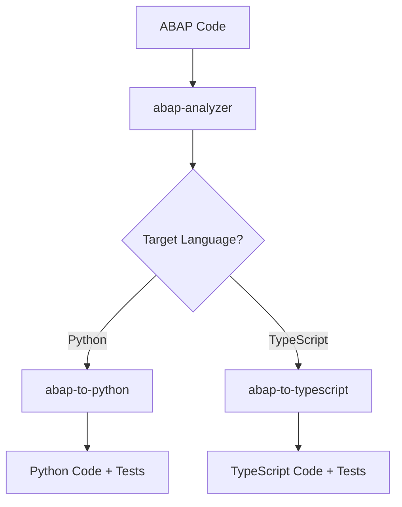

# SAP Migration Skills

This directory contains specialized Claude Code skills for SAP ABAP to Python/JavaScript migration.

## Available Skills

### 1. abap-analyzer
**File**: `abap-analyzer.md`
**Purpose**: Analyze ABAP code structure, patterns, and business logic

Analyzes any ABAP code (class, function module, report, RAP BO) to:
- Identify object type and purpose
- Extract core business logic
- Map dependencies (tables, classes, BAPIs, RFCs)
- Classify ABAP patterns used
- Assess migration complexity (Low/Medium/High)
- Recommend target architecture
- Estimate migration effort

**Output**: Comprehensive analysis report with migration strategy

**Usage**:
```
Invoke the abap-analyzer skill
```

### 2. abap-to-python
**File**: `abap-to-python.md`
**Purpose**: Translate ABAP code to idiomatic Python

Translates ABAP code to modern Python with:
- Dataclasses from ABAP structures
- Collections from internal tables
- SQLAlchemy/Django ORM from ABAP SQL
- FastAPI/Django/Flask implementations
- Type hints and documentation
- pytest test cases

**Output**: Complete Python codebase with tests and dependencies

**Usage**:
```
Invoke the abap-to-python skill
Specify: FastAPI/Django/Flask
Specify: PostgreSQL/MySQL/SQLite
```

### 3. abap-to-typescript
**File**: `abap-to-typescript.md`
**Purpose**: Translate ABAP code to idiomatic TypeScript

Translates ABAP code to modern TypeScript with:
- Interfaces/classes from ABAP structures
- Arrays/Maps from internal tables
- TypeORM/Prisma from ABAP SQL
- NestJS/Express/Fastify implementations
- Type definitions and validation
- Jest test cases

**Output**: Complete TypeScript codebase with tests and dependencies

**Usage**:
```
Invoke the abap-to-typescript skill
Specify: NestJS/Express/Fastify
Specify: TypeORM/Prisma/Sequelize
Specify: PostgreSQL/MySQL/MongoDB
```

## Skill Workflow

### Complete Migration Process



### Typical Usage Pattern

1. **Start with Analysis**
   ```
   User: Migrate zcl_flight_booking to Python

   Agent: I'll analyze the ABAP code first
   [Invokes abap-analyzer skill]
   [Reviews analysis report]
   ```

2. **Confirm Approach**
   ```
   Agent: Based on the analysis, I recommend:
   - Architecture: REST API microservice
   - Framework: FastAPI
   - Database: PostgreSQL
   - Complexity: Medium (3-5 days)

   Do you want to proceed?
   ```

3. **Generate Translation**
   ```
   User: Yes, proceed with FastAPI

   Agent: I'll translate to Python using the abap-to-python skill
   [Invokes abap-to-python skill]
   [Reviews generated code]
   [Provides complete implementation]
   ```

## Pattern Translation Examples

### Example 1: ABAP Class → Python/TypeScript

**Input (ABAP)**:
```abap
CLASS zcl_calculator DEFINITION.
  PUBLIC SECTION.
    METHODS add
      IMPORTING iv_a TYPE i
                iv_b TYPE i
      RETURNING VALUE(rv_sum) TYPE i.
ENDCLASS.
```

**Output (Python via abap-to-python)**:
```python
class Calculator:
    def add(self, a: int, b: int) -> int:
        """Add two numbers"""
        return a + b
```

**Output (TypeScript via abap-to-typescript)**:
```typescript
export class Calculator {
    add(a: number, b: number): number {
        return a + b;
    }
}
```

### Example 2: Internal Tables → Collections

**Input (ABAP)**:
```abap
DATA lt_flights TYPE TABLE OF ty_flight.
lt_flights = FILTER #( lt_all WHERE seatsmax > 150 ).
```

**Output (Python)**:
```python
flights: List[Flight] = [f for f in all_flights if f.seatsmax > 150]
```

**Output (TypeScript)**:
```typescript
const flights: Flight[] = allFlights.filter(f => f.seatsmax > 150);
```

### Example 3: ABAP SQL → ORM

**Input (ABAP)**:
```abap
SELECT carrid, connid, price
  FROM zdemo_abap_fli
  WHERE carrid = @lv_carrier
  INTO TABLE @DATA(lt_flights).
```

**Output (Python with SQLAlchemy)**:
```python
from sqlalchemy import select

stmt = select(Flight.carrid, Flight.connid, Flight.price)\
    .where(Flight.carrid == carrier)
flights = session.execute(stmt).all()
```

**Output (TypeScript with TypeORM)**:
```typescript
const flights = await flightRepository.find({
    where: { carrid: carrier },
    select: ['carrid', 'connid', 'price']
});
```

## Skill Features

### Common Features Across All Skills

✓ **Pattern Recognition**: Identifies and translates 50+ ABAP patterns
✓ **Type Safety**: Generates type-safe code (type hints, TypeScript types)
✓ **Documentation**: Includes docstrings/JSDoc comments
✓ **Testing**: Creates unit tests with pytest/Jest
✓ **Best Practices**: Follows modern language idioms
✓ **Framework Integration**: Supports popular frameworks
✓ **Error Handling**: Translates exceptions appropriately
✓ **Dependency Management**: Lists all required packages

### abap-analyzer Specific Features

✓ Complexity assessment (Low/Medium/High)
✓ Migration effort estimation
✓ Risk identification
✓ Architecture recommendations
✓ Integration point mapping
✓ Data migration planning

### abap-to-python Specific Features

✓ FastAPI endpoint generation
✓ Django models and viewsets
✓ SQLAlchemy ORM models
✓ Pydantic validation
✓ pytest fixtures and tests
✓ Type hints everywhere

### abap-to-typescript Specific Features

✓ NestJS controllers and services
✓ Express route handlers
✓ TypeORM entities
✓ Prisma schemas
✓ Class-validator decorators
✓ Jest test suites
✓ OpenAPI/Swagger annotations

## Framework Support Matrix

| ABAP Pattern | Python Solutions | TypeScript Solutions |
|-------------|------------------|---------------------|
| Function Module | FastAPI endpoint, Django view | NestJS controller, Express route |
| Class | Python class with methods | TypeScript class |
| Structure | dataclass, Pydantic model | interface, class |
| Internal Table | list, dict | Array, Map |
| Database Table | SQLAlchemy model | TypeORM entity, Prisma model |
| RAP BO | FastAPI CRUD endpoints | NestJS resource |
| ABAP Unit Test | pytest test | Jest test |

## Customization

Each skill can be customized for specific requirements:

### Target Framework Selection
- Python: FastAPI, Django, Flask
- TypeScript: NestJS, Express, Fastify

### ORM Selection
- Python: SQLAlchemy, Django ORM
- TypeScript: TypeORM, Prisma, Sequelize

### Database Selection
- Relational: PostgreSQL, MySQL, SQLite
- NoSQL: MongoDB (for appropriate use cases)

### Architecture Patterns
- REST API
- GraphQL
- Microservices
- Serverless functions
- Event-driven

## Best Practices

### When to Use Each Skill

**Use abap-analyzer when:**
- Starting any migration project
- Need to understand ABAP code complexity
- Planning migration approach
- Estimating effort
- Identifying risks

**Use abap-to-python when:**
- Migrating to Python ecosystem
- Need data processing capabilities
- ML/AI integration planned
- Team expertise is Python
- Rapid development preferred

**Use abap-to-typescript when:**
- Migrating to JavaScript/TypeScript ecosystem
- Full-stack web application
- Real-time features needed
- Team expertise is JavaScript
- Type safety critical

### Skill Combination Patterns

**Pattern 1: Complete Migration**
```
1. abap-analyzer (understand code)
2. abap-to-python OR abap-to-typescript (translate)
3. Manual review and customization
```

**Pattern 2: Evaluation Only**
```
1. abap-analyzer (assess complexity)
2. Review recommendations
3. Make go/no-go decision
```

**Pattern 3: Multi-Language**
```
1. abap-analyzer (understand code)
2. abap-to-python (backend services)
3. abap-to-typescript (API gateway/frontend)
```

## Output Quality

All skills produce production-ready code:

- ✓ Follows language best practices
- ✓ Includes comprehensive error handling
- ✓ Type-safe and validated
- ✓ Fully tested
- ✓ Well documented
- ✓ Deployment-ready

## Limitations and Considerations

### Known Limitations

1. **SAP-Specific Features**: Some SAP framework features have no direct equivalent
   - Requires architectural redesign
   - Skills provide guidance on alternatives

2. **Complex Business Logic**: Highly complex logic may need manual review
   - Skills flag complex areas
   - Provide migration notes

3. **Legacy Code**: Very old ABAP patterns may need modernization first
   - Skills identify legacy patterns
   - Suggest refactoring approach

### Human Oversight Required

- Business logic validation
- Security and authorization review
- Performance testing
- Integration testing
- Data migration validation

## Examples and Templates

Each skill includes:

- 10+ translation pattern examples
- Framework-specific templates
- Test case templates
- Deployment configurations
- Documentation templates

## Support and Resources

For skill documentation and examples:
- Check individual skill files (.md)
- Review `.claude/examples/` directory
- Reference `.claude/SAP_MIGRATION_AGENT.md`
- Consult ABAP cheat sheets (01-34)

---

**Version**: 1.0
**Last Updated**: 2025-11-15
**Skills**: abap-analyzer, abap-to-python, abap-to-typescript
